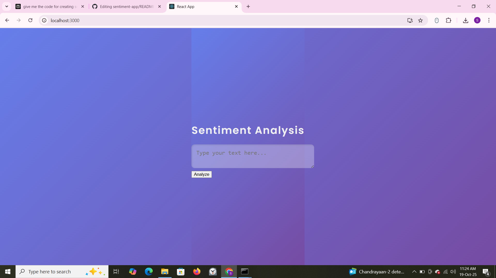
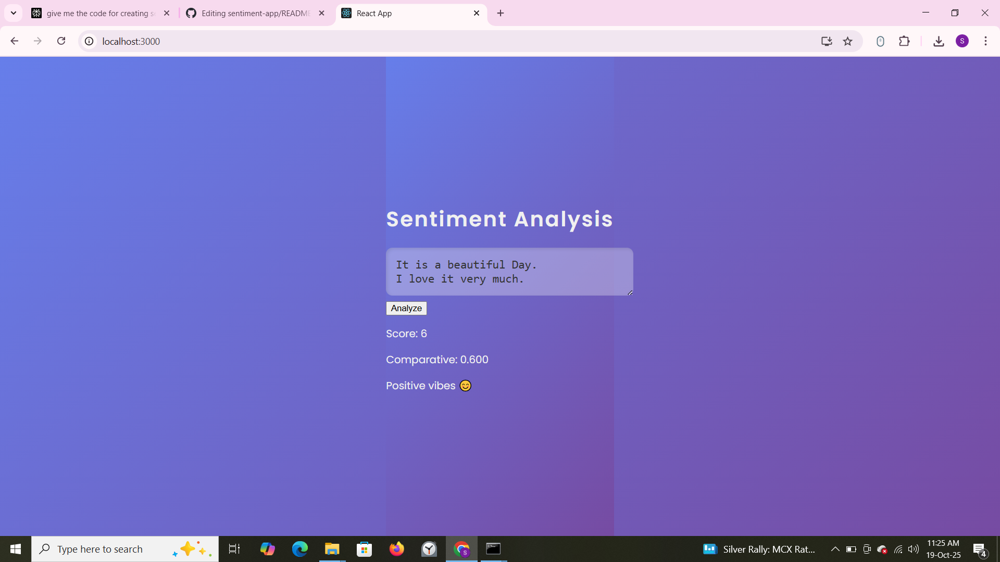

# 💬 Sentiment Analysis Web App

A full-stack **MERN (MongoDB, Express, React, Node.js)** project that analyzes the emotional tone of user text input.  
This web app showcases how text can be turned into meaningful emotional insights using **Natural Language Processing (NLP)**.

---

## ✨ Features

- 🌐 **Frontend:** Built with React.js for a responsive and dynamic UI  
- ⚙️ **Backend:** Node.js and Express.js handle data flow between frontend and database  
- 🧠 **NLP Analysis:** Uses the **Sentiment** npm library for real-time emotional scoring  
- 💾 **Database:** Stores results persistently using MongoDB  
- 📊 **User-Friendly:** Simple interface that shows live scores and descriptive feedback  
- 🚀 Perfect for students, freelancers, and beginners learning MERN stack development  

---

## 🧩 Tech Stack

| Layer | Technology Used |
|-------|------------------|
| Frontend | React.js, HTML5, CSS3 |
| Backend | Node.js, Express.js |
| Database | MongoDB (Local or Atlas) |
| NLP Library | `sentiment` (npm package) |

---

## 🖼️ Screenshots

  
*The app home page where users input their text.*

  
*Example of sentiment analysis results with score and description.*

### 1️⃣ Clone the Repository
git clone [https://github.com/sameed1879239/sentiment-app.git](https://github.com/sameed1879239/sentiment-app.git)

### 2️⃣ Install Dependencies
npm install

### 3️⃣ Start the Backend Server
cd backend
node server.js

### 4️⃣ Run the React Frontend
cd sentiment-app
npm start

Now visit [`http://localhost:3000`](http://localhost:3000) in your browser to view your app.

---

## 🧠 How It Works

1. User enters text into the input area.  
2. The text is analyzed by the **Sentiment** NLP library, which assigns sentiment scores (+, –, or 0).  
3. A sentiment description (“Positive Vibes 😊”, “Neutral”, or “Negative 😔”) appears instantly.  
4. The analyzed data (text, score, comparative) is sent to the backend and stored in MongoDB.

---

## 📈 Example Results

| Input Text | Score | Comparative | Result |
|-------------|--------|--------------|---------|
| I love learning new technologies! | +3 | +1.0 | Positive 😊 |
| This movie was terrible. | -2 | -0.5 | Negative 😔 |
| It’s okay, nothing special. | 0 | 0.0 | Neutral 😐 |

---

## 🛠️ Folder Structure
sentiment-app/
│
├── backend/
│ ├── server.js
│ ├── models/
│
├── src/
│ ├── App.js
│ ├── App.css
│
├── public/
│ ├── index.html
│
└── README.md

---

## 🎯 Project Goals

- Demonstrate **MERN stack skills** for freelance work or job portfolios  
- Show practical **Natural Language Processing (NLP)** integration in React apps  
- Provide a reusable app structure for future freelance projects  

---

## 💡 Future Improvements

- Add user authentication (login/register)  
- Visualize sentiment trends using charts  
- Deploy online using Render / Vercel + MongoDB Atlas  

---

## 🧾 About the Developer

**Sameed**  
💼 Aspiring Full-Stack Developer  
🌐 GitHub: [sameed1879239](https://github.com/sameed1879239)  
📩 Email: *(Add your professional email address)*  

---

## 📜 License
This project is open-source under the **MIT License**.

---

## 🌟 Description for Freelance Portfolio

This Sentiment Analysis App is a complete **MERN full-stack** project that transforms user text into emotional scores using **lexicon-based NLP**.  
It highlights my skills in **React frontend design**, **Node.js backend development**, **MongoDB integration**, and **API-based communication**.

---
